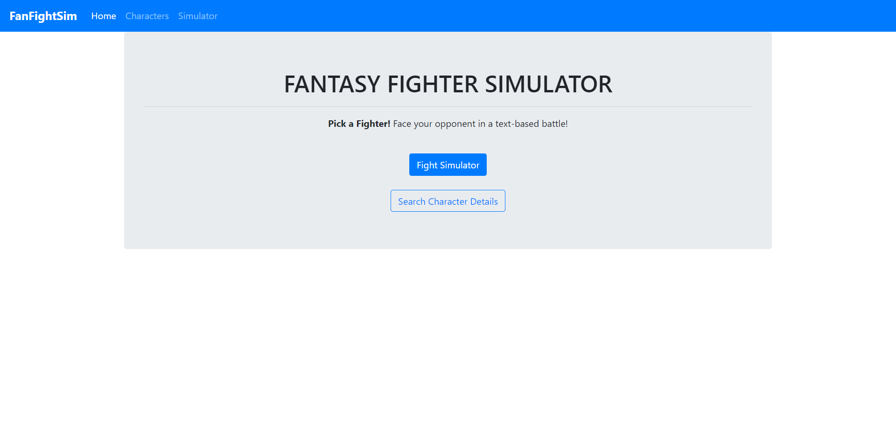
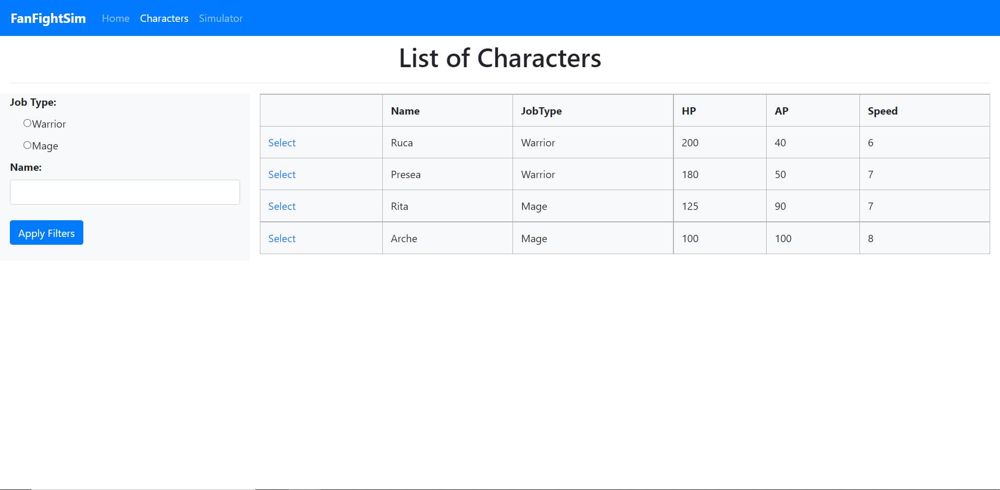
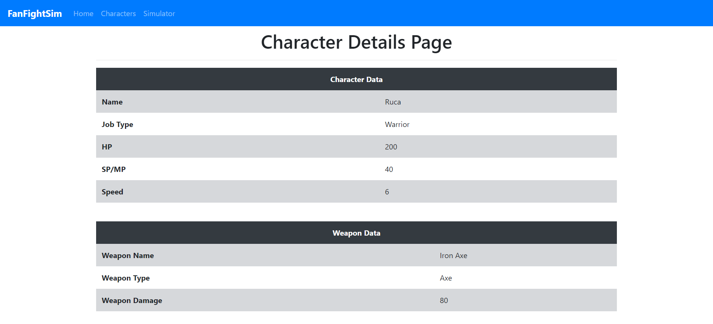
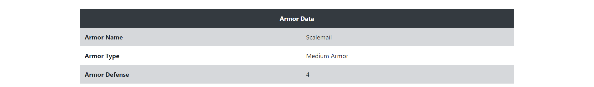
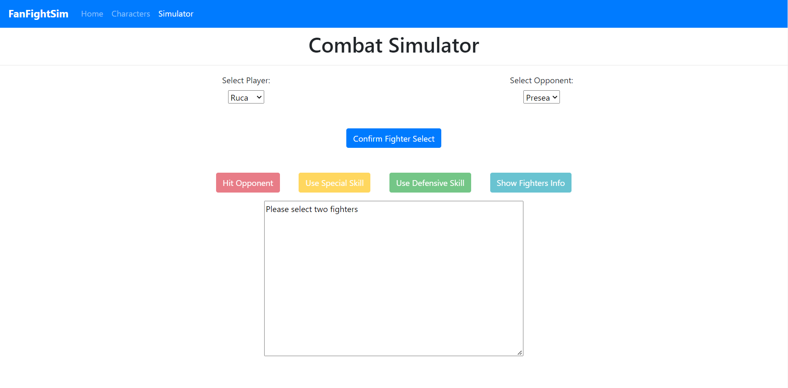

# FantasyFighterSimulator
A web app where users can commence a text-based battle with fantasy-based characters.

## Character Search
User can search for characters that they can use in the simulator listed in the database. The search is supported with fliters (e.g. filtering by job types).

## Character Details
From the Character Search page, users can select one of the rows shown to see more details on the character. Informations that can be found are on character's stats, weapon and armor.

**Character Data:**
- Name
- Job Type
- Health Points (HP)
- Ability Points (AP)
- Speed

**Weapon Data:**
- Name
- Weapon Type
- Damage Dealt

**Armor Data:**
- Name
- Armor Type
- Armor Ratings/Points

## Fight Simulator
The page in which the users will pick their character and their opponent for the fight simulator. The turn in who goes first is based on the two fighters' speed stat. On the player's turn, there are 4 buttons that they can use:
1. **Hit opponent:** Player attacks with their weapon
2. **Special Skill:** Player uses an attack that multiplies their weapon damage (different jobs have different multiplier)
3. **Defensive Skill:** Player will add Natural Armor to themselves, which acts as a second layer of defense alongside their armor
4. **Show Info:** Player can see the current HP and AP of themselves and their opponents

